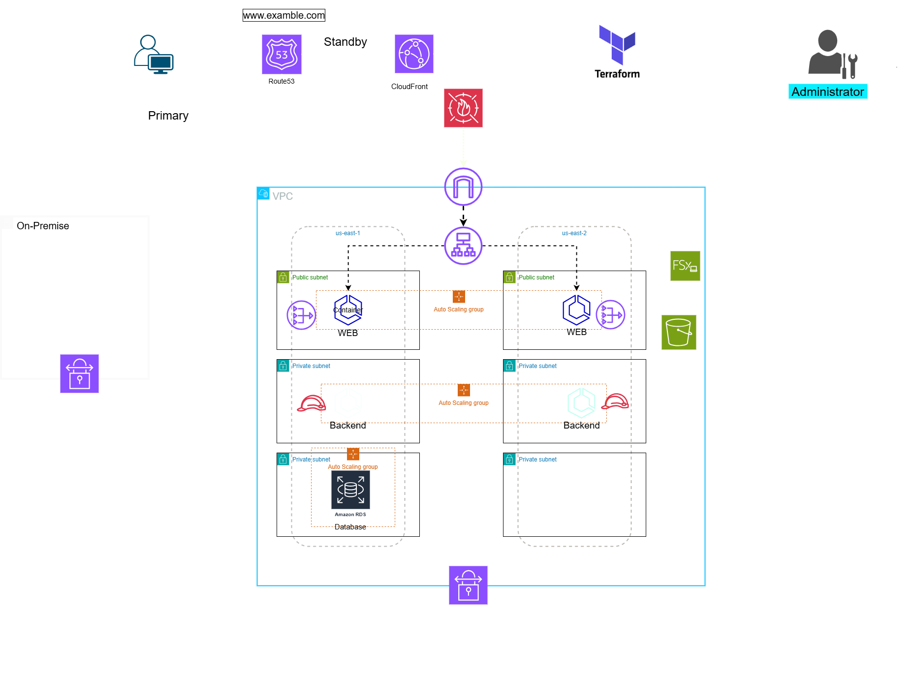

# NHN-Hotel-System_and_Disaster-Recovery_From_AWS-Cloud

Using Terraform to modernize a monolithic LEMP stack application that was locally deployed into a scalable and high availability architecture on AWS

Cloud Infrastructure & Automation (IaC)
☁️ AWS Cloud & Terraform
Transitioning from a traditional data center to a scalable, immutable modern architecture utilizing Infrastructure as Code (IaC).

Terraform
# Infrastructure as Code Principle
# Decoupled, reusable modules driving the cloud infrastructure

==================================
 module "vpc" {
 source = "./modules/networking"
 cidr   = "172.16.0.0/16" 
}
==================================

Infrastructure as Code (IaC): 100% of the AWS infrastructure is written, provisioned, and managed via Terraform. This ensures zero configuration drift, modular code reusability, and automated environment replication.

Cloud Architecture Components:

Networking (VPC): Multi-AZ public and private subnet layout, utilizing NAT Gateways for secure private-instance outbound traffic, and a Virtual Private Gateway (VGW) to terminate the IPsec VPN from the FortiGate firewall.

Compute & Auto-Scaling: High Availability setups utilizing Auto Scaling Groups (ASG) backed by Application Load Balancers (ALB) to distribute workloads dynamically.

Storage & Database: Secure S3 bucket architectures with strict bucket policies and versioning enabled, alongside managed relational databases (RDS) isolated in private database subnets.