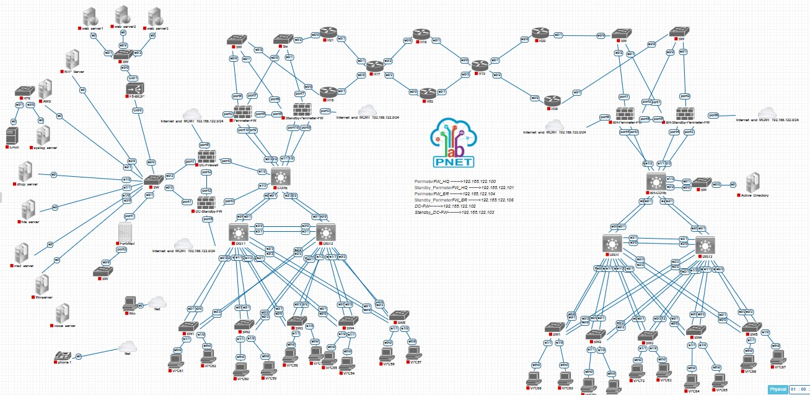

1. Network Infrastructure (Core & Security)
🔹 Routers & Switches
The backbone of the enterprise network, designed for high availability, sub-second convergence, and optimal traffic engineering.

Core/Distribution Routers: Configured for dynamic routing (OSPF/BGP), handling inter-VLAN routing, NAT/PAT boundaries, and secure WAN connectivity.

Managed Switches: Implemented robust Layer 2 security, including VLAN segmentation, Spanning Tree Protocol (STP/RSTP) hardening to prevent loops, and Port Security to mitigate unauthorized access.

🔹 Firewalls: Fortinet & FortiMail
Next-Generation Security framework ensuring absolute perimeter defense and secure hybrid cloud integration.

FortiGate Next-Generation Firewall (NGFW):

Placed as the enterprise edge gateway managing Deep Packet Inspection (DPI), Intrusion Prevention System (IPS), and SSL Inspection.

Implemented strict Zone-Based Firewall rules to isolate corporate LAN, DMZ, and Management traffic.

Configured a secure Site-to-Site IPsec VPN connecting the local infrastructure directly to the AWS VPC cloud environment.

FortiMail:

Deployed as a dedicated secure email gateway to intercept, inspect, and filter inbound/outbound email traffic.

Configured advanced threat defense mechanisms including Anti-spam, Anti-malware, and content disarm and reconstruction (CDR).

2. On-Premises Infrastructure & Enterprise Services
A fully centralized, redundant Windows Server and Linux environment managing core identity, network automation, and logging.